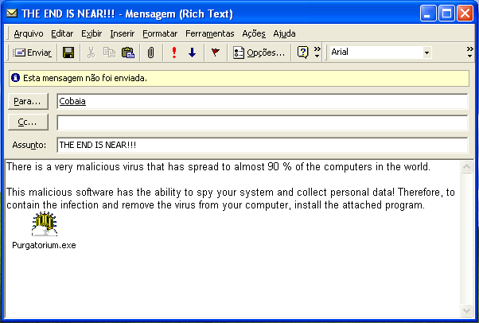
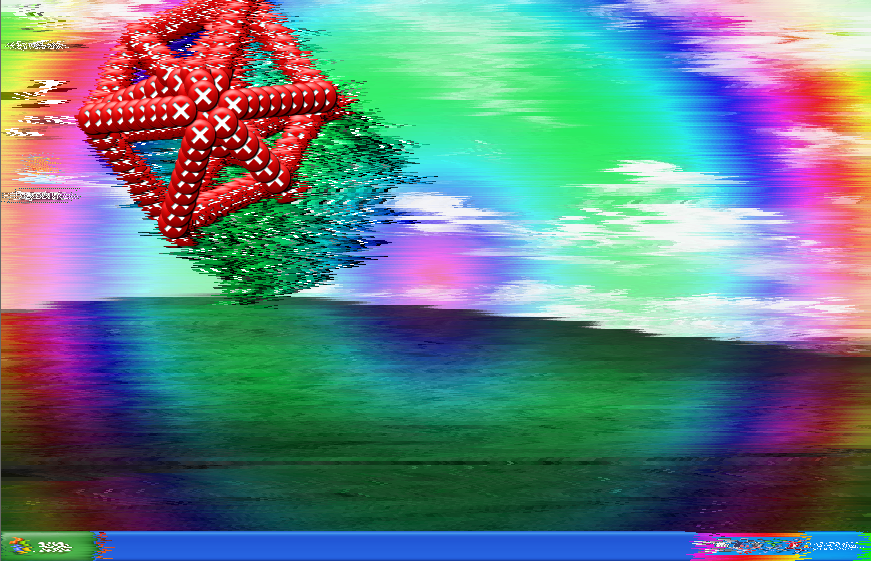
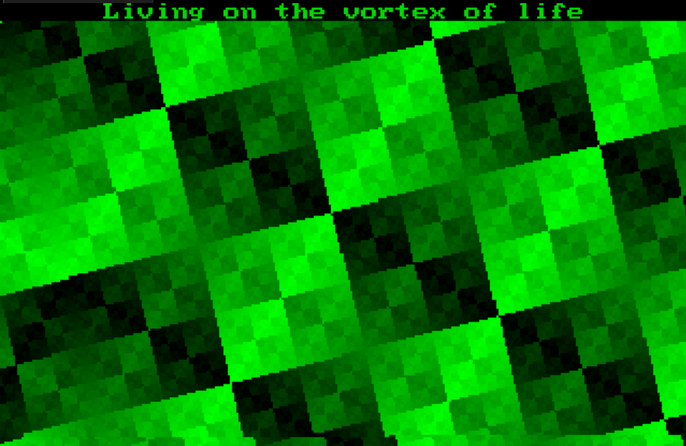
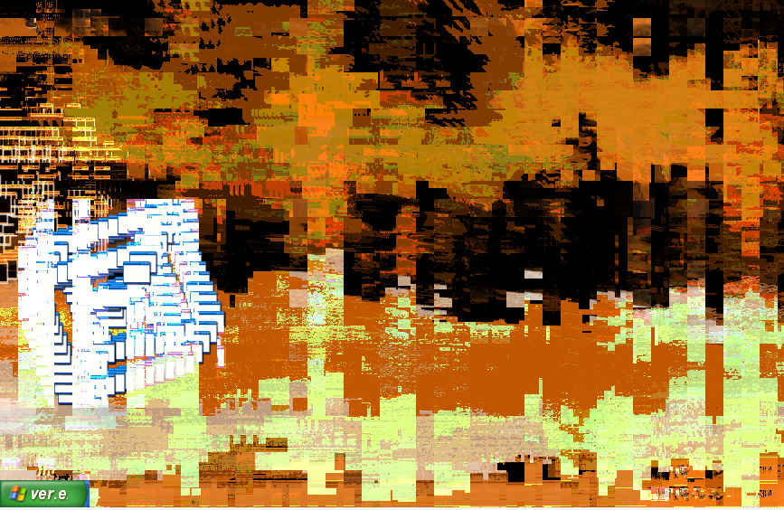
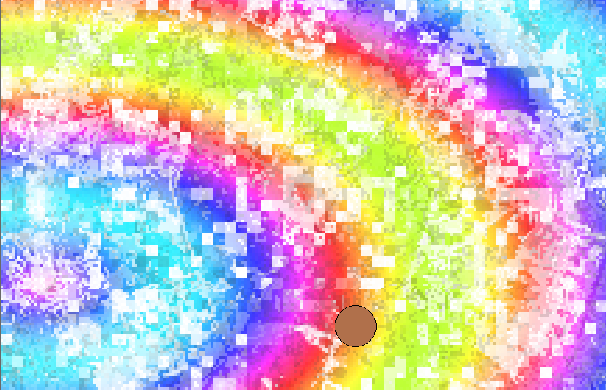
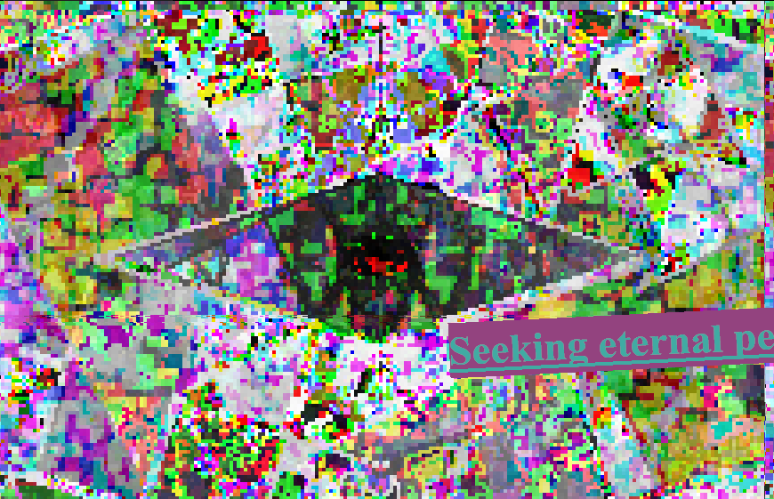
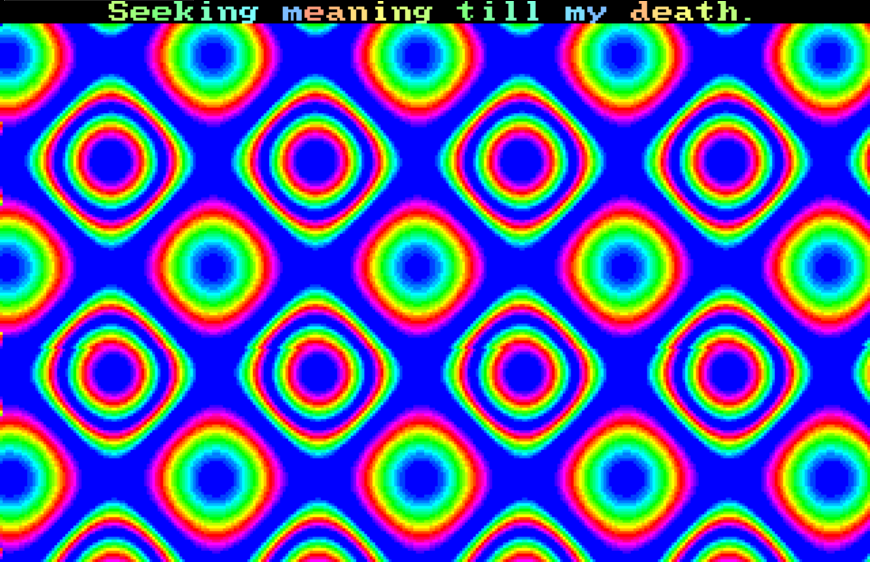
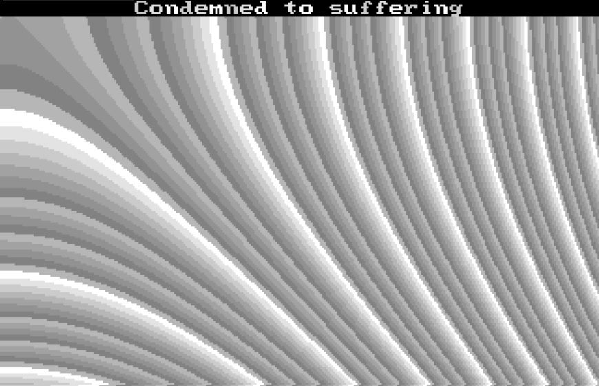

# ❓ What is Purgatorium?
Purgatorium is a GDI Email-Worm made in C++ and 8086 Assembly for Windows XP (FOR x86), if you run it on other OS, it'll shutdown the machine. Purgatorium is by far, my best and biggest project I've ever created for educational &amp; entertainment purposes, it's also very inspired on Solaris.exe. In total, it took me 1 month and 15 days to finish this work and I'm honestly very surprised with what I did...

# ⚠️ Important!!!
This is a potentially harmful program that can cause your system death & data loss. This software also displays flashing lights and plays loud sounds, so if you have a photosensitive disease like epilepsy, don't run this or watch any videos about it for your safety.

By running this program, you assume full responsibility for any damages that may occur. Therefore, the creator (ArTic a.k.a JhoPro) will not be held responsible for anything caused by this software. By the way, this was created for educational and entertainment purposes, so don't use it to do malicious acts like sharing with a friend.

# ⚙️ About the Payloads
I divided this malware into 3 parts: Restlessness, Collapse and Infernum. Find out more information below:

* <b>Restlessness part:</b> It happens after the first execution, where the malware infects the system and spreads through emails in Microsoft Outlook. This is the part where it creates and sets keys in the registry, creates copies of itself and disables the task manager, regedit and cmd. Additionally, it displays the message "THE END IS NEAR" since every 10 minutes. You know that something is not right...

* <b>Collapse part:</b> It happens when you run the worm in the year 2060. In this part it will try to delete all system32 files and will also overwrite the first 6 sectors of the disk (3072 bytes) for my bootloader + kernel. Then GDI graphic payloads starts along with bytebeats sounds. The labels in the windows will also be randomized and your keyboard will start blinking (CAPSLK & SRCLK) synchronized with the bytebeats. There is no more salvation from here...

* <b>Infernum part:</b> This is the ashes left by this worm (post-destruction), made entirely in 8086 Assembly. After booting the system, it will load my kernel, which displays 13 special effects and texts using Mode 13h, there is also a small PC Speaker compatibility.

# 👾 Common problems

* <b>Boot payload isn't working:</b> If you use VMware, try desabling `Accelerate 3D Graphics` in `Virtual Machine Settings >> Display`. If you use VBox, you can do the same in `Virtual Machine Settings >> Monitor`.

If you relate some other problem, send a detailed report at `Issues` or contact: articzera. (my discord acc)

# 🚀 Execution tips
This malware performs better than my others trojans, as the graphics are rendered at a slower resolution and then it's upscalled and displayed into your normal resolution. 

But in case you're having trouble running this malware because the payloads are too slow, try changing the resolution of your virtual machine to a lower one or increase the amount of CPU cores dedicated to the VM.

# 🤔 Fun facts
* The reason why the activation date of the last payloads is 2060 is because according to Isaac Newton, the end of the world would occur between the years 2060 and 2374, this occurred after his analysis of some books of the Bible and also after several mathematical calculations.

* This is my 4th and DEFINITELY last contribution for this community. The others were Transpire, Chorume and Lixo!

* I almost gave up doing this because I was having problems with the bootsector's part. Luckily I solve it! :D

* I had so many ideas that I had to write it in a txt file, unfortunately I couldn't put everything into this malware... In fact, I also did a lot of cool things that I decided not to put into this work and keep it to myself only.

# ❤️ For skidders
I know that some people will skid some effects after I release Purgatorium's source code to put in their malwares, and even if I complain about it, nothing will change... 

So for that reason I added a `GPLv3 license`. In other words, <b>if you use/modify a part of my code, you need to make your project open source and give me credit!</b>

# 🤝 Credits
Hessfire, Joaozin, Joel, Mist - Beta access

And thanks to everybody for the support! <3

AND SORRY BMO-37 FOR NOT DRAWING DIRECTLY AT 0xA000
I DIDN'T FORGOT, JUST THOUGHT THE SPEED WAS ALREADY GOOD!

# 🎬 Lixo Showcase
* Smooth run: https://www.youtube.com/watch?v=xcNUeFXWr6k
* Explanation (Portuguese): https://youtu.be/m9-R2g8aH9w

# 📷 Screenshots

